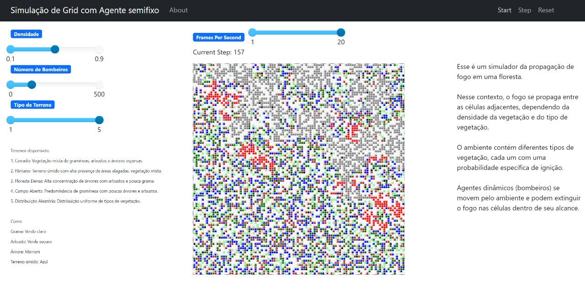
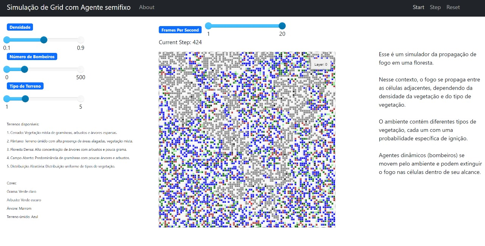
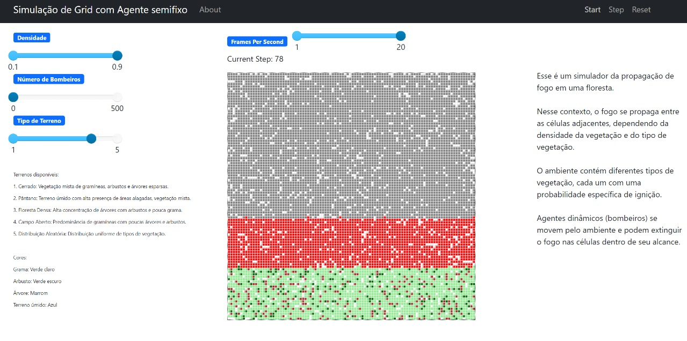

Paradigmas:
 - SMA

# Fire Spread Simulation

**Disciplina**: FGA0210 - PARADIGMAS DE PROGRAMAÇÃO - T01 <br>
**Nro do Grupo**: 03<br>
**Paradigma**: SMA<br>

## Alunos
|Matrícula | Aluno |
| -- | -- |
| 211031664  |  Catlen Cleane Ferreira de Oliveira |
| 202023681  |  Gabriel da Silva Rosa |
| 212008197  |  João Pedro Alves Machado |
| 190032821  |  Lorenzo Santos |
| 211043718  |  Paulo Victor Fonseca Sousa |
| 190020521  |  Valderson Pontes da Silva Junior |
| 190038900  |  Victor de Souza Cabral |

## Sobre 
Este projeto é uma simulação da propagação de fogo em uma floresta, utilizando o paradigma de Sistemas Multiagentes (SMA). Nesse contexto, cada árvore, arbusto ou área de vegetação é representada como um agente autônomo, com seu próprio estado e comportamento. Esses agentes interagem em uma grade bidimensional, simulando a propagação de um incêndio florestal, onde o fogo se espalha de uma célula para outra com base em fatores como tipo de vegetação e proximidade.

A simulação é implementada em Python, utilizando o framework Mesa, que facilita a criação, execução e visualização de modelos de agentes. Mesa oferece uma infraestrutura robusta para simulações em larga escala, com módulos para visualização interativa e coleta de dados, tornando-o ideal para explorar diferentes cenários e estratégias de mitigação de incêndios.

Funcionalidades principais:

**Propagação do fogo:** O fogo se propaga entre as células adjacentes, dependendo da densidade da vegetação e do tipo de vegetação.

**Tipos de Terreno e vegetação:** O ambiente contém diferentes tipos de Terreno, cada um com uma probabilidade específica de vegetação e cada vegetação com sua possibilidade de ignição.

**Extinção do fogo:** Agentes dinâmicos (bombeiros) se movem pelo ambiente e podem extinguir o fogo nas células dentro de seu alcance.

**Interface gráfica:** A simulação é visualizada em uma interface gráfica que permite ajustar parâmetros como densidade da vegetação e número de agentes dinâmicos.

## Screenshots






## Instalação 
**Linguagens**: Python<br>
**Tecnologias**: Mesa<br>

## Comandos para instalação

1. **Clone o repositório:**

    ```sh
    git clone https://github.com/UnBParadigmas2024-1/2024.1_G3_SMA_FireSpread_Simulation.git
    ```

2. **Navegue até o diretório do projeto:**

    ```sh
    cd 2024.1_G3_SMA_FireSpread_Simulation
    ```

2. **Verifique se o Python 3 está instalado:**

    ```sh
    python3 --version
    ```

3. **Instale o pip (gerenciador de pacotes do Python):**

    ```sh
    sudo apt-get install python3-pip
    ```

    Essa instalação considera sistemas baseados em Debian/Ubuntu, em outros sistemas operacionais você pode seguir as instruções específicas para instalar o pip.

4. **Instale o Mesa:**

    ```sh
    pip install mesa
    ```

## Executando a simulação 

Para iniciar a simulação, execute o comando estando no repositório do projeto:

    ```sh
    python3 server.py
    ```

A simulação será aberta em uma interface web onde você poderá ajustar parâmetros e observar a propagação do fogo na grade.

## Uso 
A simulação permite ajustar a densidade da vegetação e o número de agentes dinâmicos (bombeiros) que tentarão extinguir o fogo. 

Na interface, você pode:

**Ajustar a densidade:** Use o controle deslizante para alterar a densidade inicial da vegetação.

**Ajustar o número de agentes dinâmicos:** Use o controle deslizante para definir quantos bombeiros estarão presentes na simulação.

**Iniciar a simulação:** Clique em "Start" para começar a simulação e observar o fogo se espalhar na floresta.

**Executar passo a passo:** Use o botão "Step" para avançar a simulação um passo de cada vez, permitindo uma análise mais detalhada do comportamento dos agentes.

**Reiniciar a simulação:** Clique em "Reset" para redefinir a simulação para as condições iniciais e com os atuais parâmetros dos slides, permitindo novos experimentos.

**Monitorar o progresso:** O estado de cada célula na grade é visualizado como uma cor diferente: verde para vegetação saudável, vermelho para células em chamas, cinza para áreas queimadas, e preto para agentes dinâmicos.

GIF de utilização do projeto:


## Vídeo
[Vídeo de apresentação do Projeto - Fire Spread Simulation](link)
<br>
[Video no YouTube](link)

## Participações
Apresente, brevemente, como cada membro do grupo contribuiu para o projeto.
|Nome do Membro | Contribuição | Significância da Contribuição para o Projeto (Excelente/Boa/Regular/Ruim/Nula) |
| -- | -- | -- |
| Catlen Cleane Ferreira de Oliveira  |Programação dos tipos de matas e a probabilidade de ignição|Boa|
| Gabriel da Silva Rosa  |  Programação dos tipos de matas e a probabilidade de ignição | Boa |
| João Pedro Alves Machado  |Criação da logica do bombeiro e implementação do combate a progação do fogo  | Boa  |
| Lorenzo Santos  |Programação inicial da floresta e do fogo se espalhando com o tempo|Excelente|
| Paulo Victor Fonseca Sousa  | Adicionei filtro de tipos de terreno com  5 vegetações diferentes interativas, e atualizei a interface gráfica | Excelente |
| Valderson Pontes da Silva Junior  |   Criação da logica do bombeiro e implementação do combate a progação do fogo  | Boa  |
| Victor de Souza Cabral  | Simulação da propagação do fogo na floresta, iniciando o fogo em agentes específicos, lógica de dispersão do fogo, criando controle de densidade e probabilidade de ignição entre elementos adjacentes.  | Excelente |

## Outros

### Lições Aprendidas:

**Uso do Mesa:** Ganhamos experiência prática em criar e gerenciar agentes autônomos e modelos, além de explorar a capacidade do Mesa para visualizações em tempo real e análise de comportamentos.

**Modelagem da propagação:** Entendemos como diferentes variáveis, como tipos de vegetação e densidade, afetam a propagação do fogo, o que nos ajudou a balancear realismo com simplicidade no modelo.

### Percepções:

**Poder e Desafios dos Sistemas Multiagentes::** SMA são ferramentas poderosas para simulações complexas, mas exigem um cuidado especial na otimização e depuração, especialmente em cenários com muitos agentes e interações.

**Equilíbrio entre simplicidade e realismo:** Foi desafiador manter a simulação simples, mas ainda realista. Algumas simplificações eram necessárias para garantir que o modelo fosse compreensível e funcional.

### Contribuições e Fragilidades:

**Projeto:**  A introdução de diferentes tipos de vegetação e agentes dinâmicos trouxe uma profundidade significativa a simulação, permitindo a exploração de vários cenários. No entanto, o ajuste das probabilidades de ignição e a gestão do desempenho em larga escala foram desafios.

**Limitações:**  A simulação, enquanto eficaz em menor escala, enfrenta problemas de desempenho a medida que a escala aumenta, indicando que futuras otimizações são necessárias para lidar com ambientes maiores.

### Trabalhos Futuros:

**Otimização:** Seria interessante explorar a paralelização e outras técnicas para melhorar o desempenho, especialmente em simulações de grande escala.

**Integração com dados reais:** Seria interessante integrar dados reais sobre vegetação e clima para aumentar a precisão e aplicabilidade da simulação.

**Expansão dos agentes:** Adicionar novas funcionalidades e comportamentos aos agentes dinâmicos, permitindo simulações de cenários mais complexos, como a resposta a múltiplos focos de incêndio ou a interação com outros fatores ambientais como o vento, por exemplo.

## Fontes

- https://scipython.com/blog/the-forest-fire-model/

- https://notebook.community/projectmesa/mesa-examples/examples/ForestFire/Forest%20Fire%20Model

- https://github.com/projectmesa/mesa-examples/tree/main/examples/forest_fire
